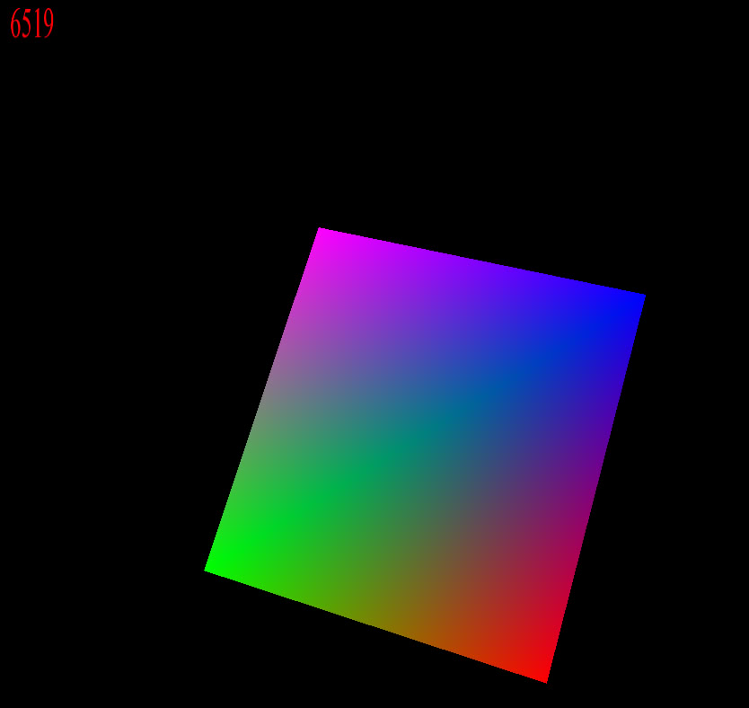

# Reder is a 3D - renderer prototype. It uses my own MVM library to for necessary calculations and SFML for the purpose of drawing projected verticies. 
This idea will be fully explored in my future project, RederGL, based on the OpenGL to take advantage of its z-buffering capabilities.

* all of the libraries are installed via FetchContent feature of cmake, which requires internet to build project.
---

